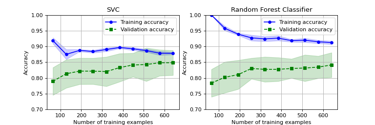

# 220213_kaggle_Practice_Titanic---Machine-Learning-from-Disaster
かの有名なTitanicコンペ練習用レポジトリ。

## Log
### 220213
- ひとまずデータダウンロードし、欠損値補完、データ分割、標準化などやってみた後、パーセプトロンモデルで分類してみた。

#### [nb001]
- パーセプトロンモデルにて分類。正解率 0.746
- 欠損値は*Age*にNaNが含まれていたので、平均値で補完。
- 扱いが分からなかった*Name*、*Ticket*、*Cabin*はひとまず特徴量から抜いた。

  
### 220216
- ロジスティック回帰モデルで分類。

#### [nb002]
- nb001と同様に、欠損値（Age列）を平均値で補完したところ、正解率0.799。
- 欠損値のあるデータ行を削除してみたところ、データ数は891 ---> 714になったが、正解率は0.837に上昇。

  
### 220219
- SVM、決定木、ランダムフォレスト、K最近傍法にトライ。決定木をdtreevizで可視化するのに少し手間取ったが、普通にgraphvizで可視化するより全然わかりやすくてちょっと感動。
- *Name*、*Ticket*、*Cabin*は抜いたままでやっているが、分類正解率的にはどのアルゴリズムでも頭打ちな感はある。
- ハイパーパラメータはいくつか手動で試して適当によさげなのを選んでいるだけなので、そろそろパラメータ最適化も試さないといけない。

#### [nb003]
- linear SVCで欠損値補完：0.776、欠損値削除：0.805、kernel SVCで欠損値削除：0.823だった。

#### [nb004]
- 決定木で欠損値補完：0.828、欠損値削除：0.823だった。
- ランダムフォレストで欠損値補完：0.821、欠損値削除：0.786だった。
- K最近傍法で欠損値補完：0.825、欠損値削除：0.819だった。

  
### 220220
- 前日までのデータ前処理で、データ全体を使って欠損値平均補完してから訓練データ、テストデータに分割していたが、良くない（テストデータのリーク）があるとわかったので修正した。
- ついでに決定木、ランダムフォレストで特徴量の重要度（寄与度）を出力した。決定木は性別だけで約0.6だったが、ランダムフォレストでは運賃、年齢、性別がそれぞれ0.25~0.30前後と、違いがあって面白い。

#### [nb005]
- nb004ベースで、データ前処理のときに分割を先に持ってくるように修正した。
- ランダムフォレストの欠損値補完：0.821のみ0.836に上がったが、他は変わらなかった。リークしていたので修正後は下がると思ったが...？

  
### 220223
- データ前処理、モデルフィッティングまで一連の流れをパイプラインにした。
- 交差検証の足掛かりとして、k分割交差検証を実装した。

#### [nb006]
- nb004で一番結果の良かった欠損値平均補完/ランダムフォレストモデルでパイプラインを作成。
- 層化k分割交差検証ができるようにした。

  
### 220226
- Learning Curve、Validation Curveをプロット。
- グリッドサーチによるハイパーパラメータ探索を始めたが、組み合わせ数を多くしすぎて断念。続きは明日やる。

#### [nb006]
- k分割交差検証し、その結果をLearinig Curve（横軸が訓練データ数）、Validation Curve（横軸がランダムフォレストの決定木数）でプロットした。
- どちらのプロットでも、訓練データ数、決定木数に関わらず、訓練データ正解率0.97程度、検証データ正解率0.80程度と、バリアンスの高さが浮き彫りになった。データをしっかり見て、特徴量を増やす必要がある。
(※22/3/5追記：max_depthを設定してみたところ、下図のように訓練データによる過学習が抑制された。)

  
### 220227
- 昨日途中になってしまったSVCモデルでのグリッドサーチを実装した。kernel=poly, sigmoidでは、max_iterを設定しないといつまで経っても収束しない？気がした。
- バリアンスが高い現状を踏まえ、より特徴量を増やすべく、これまで省いていたデータ列*Name*、*Ticket*、*Cabin*を使えるようにする処理を始めた。
- *Age*の欠損値処理で、グループ分けして各グループの中央値で埋める処理の記述に思ったより時間をかけてしまった。。。

#### [nb007]
- 欠損値平均補完/SVCでパイプラインpl_svc作成。
- カーネル：linear、poly、rbf、sigmoidでパラメータ：C、γを変えてグリッドサーチを実施。

#### [nb008]
- nb007までは取り除いていた*Name*、*Ticket*、*Cabin*を特徴量として取り扱えるよう、データ処理を行う。
- *Age*、*Embarked*の処理を作成。

  
### 220302
- 引き続きnb008でのデータ前処理、特徴量作成を行った。

#### [nb008]
- *Cabin*、*Name*の処理を作成。

  
### 220305
- 引き続きnb008でのデータ前処理を行った。
- 一通り出来たデータで、nb008内でSVC、ランダムフォレストによるグリッドサーチを行った。

#### [nb008]
- データのまとめは以下。

| 特徴量 | 欠損 | 処理 |
| --- | --- | ---|
| *PassengerId* | - | インデックスとして使用する。データからは削除。 |
| *Survived* | - | 目的変数。 |
| *Pclass* | なし | そのまま使用。 |
| *Name* | なし | *Title*を抽出し、Master（未婚男）、Miss（未婚女）、Mr（既婚男）、Mrs（既婚女）、Othersに統合および分類。 |
| *Sex* | なし | One-hotエンコードして使用。 |
| *Age* | あり | *Sex*、*Pclass*ごとのグループ（6グループ）での中央値で補完。 |
| *SibSp* | なし | そのまま使用。*SibSp*+*Parch*+1による*Family size*列を作成。 |
| *Parch* | なし | そのまま使用。*SibSp*+*Parch*+1による*Family size*列を作成。 |
| *Ticket* | なし | 1文字目で分類する列*Ticket_first*、および文字列長さで分類する列*Ticket_length*の2種類を作成。 |
| *Fare* | あり（Testのみ） | 平均値で補完。 |
| *Cabin* | あり | 先頭のアルファベットを抽出し、欠損値はZとする列*Deck*作成。 |
| *Embarked* | あり（少数）| 最頻値で補完。 |

- nb007と同様にSVC、またランダムフォレストによるグリッドサーチを実施。SVC：(検証) 0.848 / (テスト) 0.832、ランダムフォレスト：(検証) 0.841 / (テスト) 0.810。
- ランダムフォレストはmax_depthを設定しないと訓練データの正解率1.0になるまでやってしまい、検証データ、テストデータは0.8前後となってしまっていた。グリッドサーチにmax_depthも盛り込み、改善した。
- 両モデルのLearning Curveも、割といい感じに見える。nb006での訓練データがやけに高いLearning Curveも、max_depthを設定していなかったのが原因と考え、設定してやってみたところ過学習が抑制された。（nb006に追記済）

  
### 220306
- nb008ベースでkaggle_nb001を作成し、Submitしてみた。

#### [kaggle_nb001]
- **Best score**: 0.778 (Version 2)
- nb008ベースで作成。TrainデータとTestデータを結合し、*TrainFlag*列を設けることで処理後に再分割する方法を見たのでそれで実施。（厳密にはあんまよろしくない？　やはり平均値補完とかは訓練データだけで求めたものをテストには入れるべきなんだろうか。）
- SVC（Version 1）とランダムフォレスト（Version 2）でグリッドサーチしてベストモデルでSubmit。SVC：0.770、ランダムフォレスト：0.778で若干ランダムフォレストが良い。上位29%。

  
### 220312
- kaggle_nb001のハイパーパラメータを再調整したところ、0.05程度正解率アップ。

#### [kaggle_nb001]
- **Best score**: 0.782 (Version 4)
- Version 3: Version 2のランダムフォレストは10までだったmax_depthを、[5, 10, 15, 20, 25, 30]の範囲に広げた。スコア0.775で微減。
- Version 4: さらにmin_samples_splitを[5, 10, 15, 20, 25, 30]の範囲でグリッドサーチに加えたところ、スコア0.782。

  
### 220313
- いくつかのモデルを組み合わせてアンサンブルモデルを作成した。
- *Name*を用いて同じ家族を同定し、生存率を計算した新たな列*Family_SurvRate*を作成して解析を行った。

#### [nb009]
- SVC、ランダムフォレスト、ADAブースティングを使ったアンサンブルモデルを作成。
- Trainデータから分離したテストデータの正解率　SVC：0.827、ランダムフォレスト：0.810、ADAブースティング：0.777だったが、多数決アンサンブルでは0.816と、低いほうに引っ張られた。そういうものなのかもしれないが。。。

#### [kaggle_nb002]
- **Best score**: 0.782 (Version 2)
- nb009ベースでアンサンブルを取り入れたモデルでSubmit。結果としてはkaggle_nb001のBestと同じ。

#### [nb010]
- *Name*を用いて同じ家族を同定し、生存率を計算した新たな列*Family_SurvRate*を作成。Testデータにしかいない姓は生存率計算できないため、平均値で補完し*Family_SurvRate_NA*列に1を入れることとした。
- Trainデータから分離したテストデータの正解率はSVC、ランダムフォレスト、ADAブースティングともに0.989と大きく改善した。
(※22/3/19追記：同じ姓が1人しかいないケースでは生存率は正解ラベルに直結するのでTrainデータで正解率が高くなるのは当たり前だった。22/3/19に修正。)

  
### 220319
- 3/13に実装した姓からの生存率は正解ラベルのリークが発生していたので、修正した。
- *Ticket*を使って同じグループ内の生存率を計算した新たな列*Ticket_SurvRate*を作成した。

#### [nb010]
- 3/13の実装では、同じ姓が1人しかいないケースでは生存率＝正解ラベルとなるので、1人のみの*Family_SurvRate*は一括して生存率の平均で埋めることとした。
- Trainデータから分離したテストデータの正解率はSVC：0.883、ランダムフォレスト：0.855、ADAブースティング：0.838、多数決アンサンブル：0.877となった。
- *Ticket*を用いて上4桁が同じチケット番号のグループ内で生存率を計算し、新たな列*Ticket_SurvRate*を作成。Testデータにしかない番号は生存率計算できないため、平均値で補完し*Ticket_SurvRate_NA*列に1を入れることとした。また1人のみのグループも同じように平均で埋めた。(※22/3/20追記：上6桁抽出のほうがSubmitスコア良かったため修正。)
- Trainデータから分離したテストデータの正解率はSVC：0.894、ランダムフォレスト：0.883、ADAブースティング：0.866、多数決アンサンブル：0.888となった。
- 現時点でのデータのまとめは以下。

| 特徴量 | 欠損 | 処理 |
| --- | --- | ---|
| *PassengerId* | - | インデックスとして使用する。データからは削除。 |
| *Survived* | - | 目的変数。 |
| *Pclass* | なし | そのまま使用。 |
| *Name* | なし | *Title*を抽出し、Master（未婚男）、Miss（未婚女）、Mr（既婚男）、Mrs（既婚女）、Othersに統合および分類。***Surname*を抽出し、同じグループ内で生存率を計算。** |
| *Sex* | なし | One-hotエンコードして使用。 |
| *Age* | あり | *Sex*、*Pclass*ごとのグループ（6グループ）での中央値で補完。 |
| *SibSp* | なし | そのまま使用。*SibSp*+*Parch*+1による*Family size*列を作成。 |
| *Parch* | なし | そのまま使用。*SibSp*+*Parch*+1による*Family size*列を作成。 |
| *Ticket* | なし | 1文字目で分類する列*Ticket_first*、および文字列長さで分類する列*Ticket_length*の2種類を作成。***Ticket_num*(番号上6桁)を抽出し、同じグループ内で生存率を計算。** |
| *Fare* | あり（Testのみ） | 平均値で補完。 |
| *Cabin* | あり | 先頭のアルファベットを抽出し、欠損値はZとする列*Deck*作成。 |
| *Embarked* | あり（少数）| 最頻値で補完。 |

#### [kaggle_nb003]
- **Best score**: 0.782 (Version 3)
- nb010ベースで、*Family_SurvRate*と*Ticket_SurvRate*を導入したデータで解析した。
- *Family_SurvRate*のみ導入したVersion 3に比べ、*Ticket_SurvRate*を入れるとTrainデータのCVでは上がったが、Submission値は低下した。(Version 4: 0.766)

  
### 220320
- *Ticket_num*の抽出桁数を変えるなど、kaggle_nb003を少し修正。
- 欠損が多かった*Cabin*(*Deck*)を他の特徴量から予測できないかと考え、*Deck*を予測する手順を追加。

#### [kaggle_nb003]
- **Best score**: 0.789 (Version 7)
- 多数決アンサンブルをやめてランダムフォレストのみにしたのと、*Ticket_num*の抽出を上6桁にしたところ少し改善し、これまでのトップスコアとなった。上位9%。

#### [nb011]
- 他の特徴量を用いて*Deck*を予測し、欠損を表すZを予測した値で埋めるデータ作成を追加。予測（分類）にはランダムフォレストを使用。
- Trainデータから分離したテストデータの正解率はSVC：0.872、ランダムフォレスト：0.894、ADAブースティング：0.872、多数決アンサンブル：0.888となり大きく向上とはならなかった。
- データまとめは以下。
 
| 特徴量 | 欠損 | 処理 |
| --- | --- | ---|
| *PassengerId* | - | インデックスとして使用する。データからは削除。 |
| *Survived* | - | 目的変数。 |
| *Pclass* | なし | そのまま使用。 |
| *Name* | なし | *Title*を抽出し、Master（未婚男）、Miss（未婚女）、Mr（既婚男）、Mrs（既婚女）、Othersに統合および分類。*Surname*を抽出し、同じグループ内で生存率を計算。 |
| *Sex* | なし | One-hotエンコードして使用。 |
| *Age* | あり | *Sex*、*Pclass*ごとのグループ（6グループ）での中央値で補完。 |
| *SibSp* | なし | そのまま使用。*SibSp*+*Parch*+1による*Family size*列を作成。 |
| *Parch* | なし | そのまま使用。*SibSp*+*Parch*+1による*Family size*列を作成。 |
| *Ticket* | なし | 1文字目で分類する列*Ticket_first*、および文字列長さで分類する列*Ticket_length*の2種類を作成。*Ticket_num*(番号上6桁)を抽出し、同じグループ内で生存率を計算。 |
| *Fare* | あり（Testのみ） | 平均値で補完。 |
| *Cabin* | あり | 先頭のアルファベットを抽出し、~~欠損値はZとする~~列*Deck*作成。**欠損値は他の特徴量から予測して埋める。** |
| *Embarked* | あり（少数）| 最頻値で補完。 |

- *Deck*の分布は以下。予測前はCが最多（Z除く）だが、予測後はFが最多になっている。

#### [kaggle_nb004]
- **Best score**: 0.801 (Version 1)
- nb011ベース。nb011ではTrainデータでの分析はそこまで向上しなかった印象だが、Testデータではハイスコアとなった。
