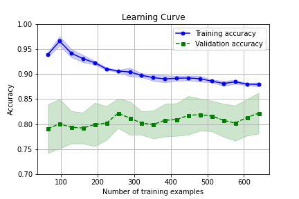

# 220213_kaggle_Practice_Titanic---Machine-Learning-from-Disaster
かの有名なTitanicコンペ練習用レポジトリ。

## Log
### 220213
- ひとまずデータダウンロードし、欠損値補完、データ分割、標準化などやってみた後、パーセプトロンモデルで分類してみた。

#### [nb001]
- パーセプトロンモデルにて分類。正解率 0.746
- 欠損値は*Age*にNaNが含まれていたので、平均値で補完。
- 扱いが分からなかった*Name*、*Ticket*、*Cabin*はひとまず特徴量から抜いた。

  
### 220216
- ロジスティック回帰モデルで分類。

#### [nb002]
- nb001と同様に、欠損値（Age列）を平均値で補完したところ、正解率0.799。
- 欠損値のあるデータ行を削除してみたところ、データ数は891 ---> 714になったが、正解率は0.837に上昇。

  
### 220219
- SVM、決定木、ランダムフォレスト、K最近傍法にトライ。決定木をdtreevizで可視化するのに少し手間取ったが、普通にgraphvizで可視化するより全然わかりやすくてちょっと感動。
- *Name*、*Ticket*、*Cabin*は抜いたままでやっているが、分類正解率的にはどのアルゴリズムでも頭打ちな感はある。
- ハイパーパラメータはいくつか手動で試して適当によさげなのを選んでいるだけなので、そろそろパラメータ最適化も試さないといけない。

#### [nb003]
- linear SVCで欠損値補完：0.776、欠損値削除：0.805、kernel SVCで欠損値削除：0.823だった。

#### [nb004]
- 決定木で欠損値補完：0.828、欠損値削除：0.823だった。
- ランダムフォレストで欠損値補完：0.821、欠損値削除：0.786だった。
- K最近傍法で欠損値補完：0.825、欠損値削除：0.819だった。

  
### 220220
- 前日までのデータ前処理で、データ全体を使って欠損値平均補完してから訓練データ、テストデータに分割していたが、良くない（テストデータのリーク）があるとわかったので修正した。
- ついでに決定木、ランダムフォレストで特徴量の重要度（寄与度）を出力した。決定木は性別だけで約0.6だったが、ランダムフォレストでは運賃、年齢、性別がそれぞれ0.25~0.30前後と、違いがあって面白い。

#### [nb005]
- nb004ベースで、データ前処理のときに分割を先に持ってくるように修正した。
- ランダムフォレストの欠損値補完：0.821のみ0.836に上がったが、他は変わらなかった。リークしていたので修正後は下がると思ったが...？

  
### 220223
- データ前処理、モデルフィッティングまで一連の流れをパイプラインにした。
- 交差検証の足掛かりとして、k分割交差検証を実装した。

#### [nb006]
- nb004で一番結果の良かった欠損値平均補完/ランダムフォレストモデルでパイプラインを作成。
- 層化k分割交差検証ができるようにした。

  
### 220226
- Learning Curve、Validation Curveをプロット。
- グリッドサーチによるハイパーパラメータ探索を始めたが、組み合わせ数を多くしすぎて断念。続きは明日やる。

#### [nb006]
- k分割交差検証し、その結果をLearinig Curve（横軸が訓練データ数）、Validation Curve（横軸がランダムフォレストの決定木数）でプロットした。
- どちらのプロットでも、訓練データ数、決定木数に関わらず、訓練データ正解率0.97程度、検証データ正解率0.80程度と、バリアンスの高さが浮き彫りになった。データをしっかり見て、特徴量を増やす必要がある。（※22/3/5追記：max_depthを設定してみたところ、下図のように訓練データによる過学習が抑制された。）

  
### 220227
- 昨日途中になってしまったSVCモデルでのグリッドサーチを実装した。kernel=poly, sigmoidでは、max_iterを設定しないといつまで経っても収束しない？気がした。
- バリアンスが高い現状を踏まえ、より特徴量を増やすべく、これまで省いていたデータ列*Name*、*Ticket*、*Cabin*を使えるようにする処理を始めた。
- *Age*の欠損値処理で、グループ分けして各グループの中央値で埋める処理の記述に思ったより時間をかけてしまった。。。

#### [nb007]
- 欠損値平均補完/SVCでパイプラインpl_svc作成。
- カーネル：linear、poly、rbf、sigmoidでパラメータ：C、γを変えてグリッドサーチを実施。

#### [nb008]
- nb007までは取り除いていた*Name*、*Ticket*、*Cabin*を特徴量として取り扱えるよう、データ処理を行う。
- *Age*：*Pclass*、*Sex*の組み合わせでグループを作り、各グループの中央値で欠損値を埋めた。
- *Embarked*：欠損が2個だけだったので、最頻値で欠損値を埋めた。

  
### 220302
- 引き続きnb008でのデータ前処理、特徴量作成を行った。

#### [nb008]
- *Cabin*：先頭のアルファベットを抽出し、欠損値はZで補完した。
- *Name*：Titleを取り出し、Master、Miss、Mr、Mrs、Othersに分類した。

  
### 220305
- 引き続きnb008でのデータ前処理を行った。
- 一通り出来たデータで、nb008内でSVC、ランダムフォレストによるグリッドサーチを行った。

#### [nb008]
- *Ticket*：1文字目で分類する列、および文字列長さで分類する列の2種類を作成した。
- *SibSp*/*Parch*：*SibSp*+*Parch*+1による*Family size*列を追加した。
- 出来たデータのカテゴリ列をone-hot-encodeし、nb007と同様にSVC、またランダムフォレストによるグリッドサーチを実施。SVC：(検証) 0.848 / (テスト) 0.832、ランダムフォレスト：(検証) 0.841 / (テスト) 0.810。
- ランダムフォレストはmax_depthを設定しないと訓練データの正解率1.0になるまでやってしまい、検証データ、テストデータは0.8前後となってしまっていた。グリッドサーチにmax_depthも盛り込み、改善した。
- 両モデルのLearning Curveも、割といい感じに見える。nb006での訓練データがやけに高いLearning Curveも、max_depthを設定していなかったのが原因と考え、設定してやってみたところ過学習が抑制された。（nb006に追記済）

